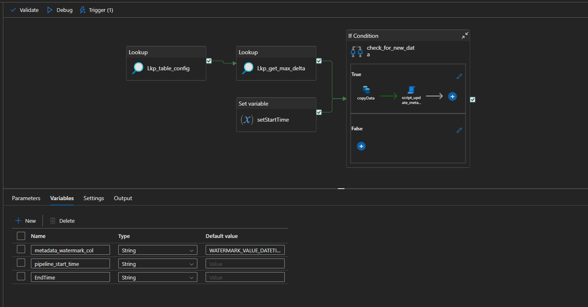
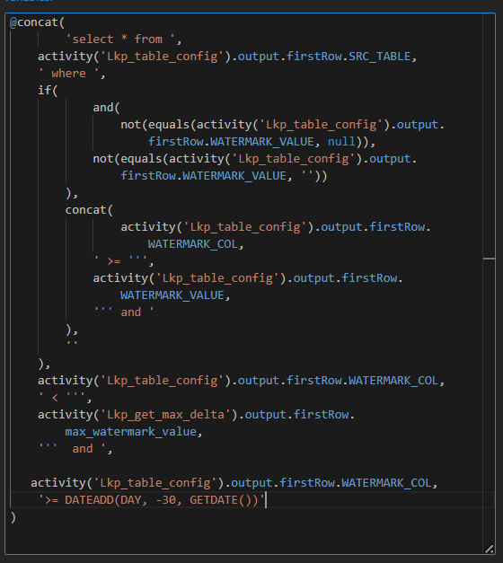
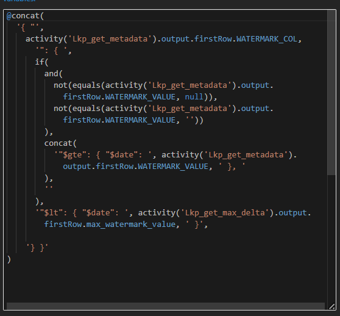

<h1 align="center">🚀 Azure Data Factory Templates</h1>

  A curated collection of reusable Azure Data Factory (ADF) pipeline templates for database and file-based data movement.  
  Designed for quick deployment, scalability, and clarity.

---

## 📁 One-Time Multi Tables Pipeline

  

  

---

## 🧩 Table to ADLS Pipeline

  

### 🔁 Incremental Source Query

  

---

## 🍃 Mongo Table to ADLS Pipeline

  

### 🔁 Incremental Mongo Source Query

  

---

